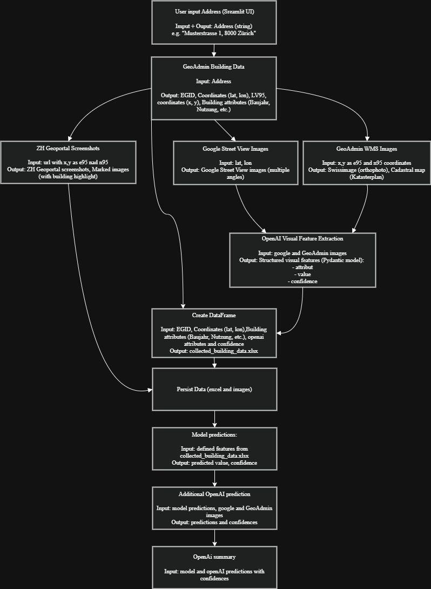
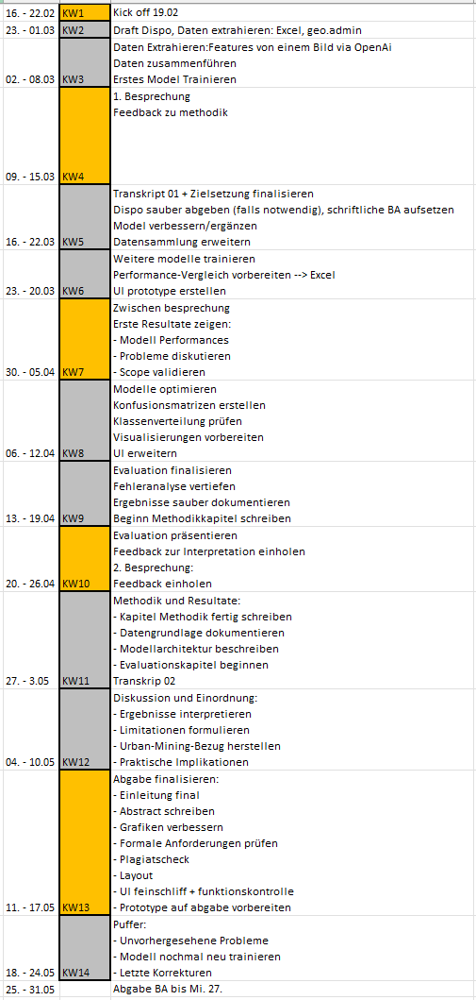

# Building Attribute Prediction System

## 📌 Project Overview

This project aims to develop a prototype system that predicts building characteristics using:

Tabular data (e.g., construction year, registry data)
Image data (e.g., facade / street view images)

The system combines machine learning models with AI-based image analysis to infer building attributes such as:

- Facade type
- Roof type
- Windows
- Hazardous materials (Schadstoff)

## Features

- GeoAdmin Integration (Swiss geodata)
- Google Maps API (Street View & Satellite)
- Image-based feature extraction using OpenAI (LLM + vision)
- Machine learning models (CatBoost, Random Forest)
- Ensemble prediction pipeline
- Confidence-based predictions
- Automated map screenshot generation (ZH Geoportal)

## Project Structure
```` 
building-analysis-ai/
│
├── buildings/                     # Gesammelte Bilder pro Gebäude (EGID)
│   ├── <EGID>/
│   │   ├── streetview_*.jpeg
│   │   ├── cadastral_*.png
│   │   ├── zh_map.png
│   │   └── zh_map_ortho.png
│
├── data/                          # Datensätze & Excel-Dateien
│   ├── collected_building_data.xlsx
│   ├── Gebaeudescreening_winti.xlsx
│   ├── model_dataset.xlsx
│   └── test_sample.xlsx
│
├── openai_services/               # OpenAI Integration
│   ├── building_image_schema.py
│   ├── openai_feature_service.py
│   ├── additional_openai_prediction.py
│   └── openai_final_analysis_service.py
│
├── prediction_model/
│   ├── models/                    # Trainierte Modelle je Attribut
│   │   ├── fassade_bekleidung/
│   │   ├── dach_bekleidung/
│   │   ├── fenster/
│   │   ├── schadstoff/
│   │   └── ...
│   │
│   ├── doc_prediction_models.py
│   ├── doc_prediction_models.xlsx
│   ├── doc_prediction_models_new.xlsx
│   ├── model_error_analysis.py
│   └── var_combinations.xlsx
│
├── scripts/                       # Datenverarbeitung & Dataset-Erstellung
│   ├── generate_model_dataset.py
│   └── model_dataset_analysis.py
│
├── services/                      # Core Services (Backend Logik)
│   ├── building_image_service.py
│   ├── geo_admin_service.py
│   ├── zh_map_service.py
│   ├── combined_prediction_service.py
│   ├── cb_prediction_service.py
│   └── rf_prediction_service.py
│
├── src/                           # optional / nicht aktiv genutzt
│   └── main.py
│
├── MyApp.py                       # Streamlit UI
├── .env / .env.example
├── requirements.txt
├── pyproject.toml
├── README.md
└── goalTimeTable.png
````
## Data Sources

- GeoAdmin (Swiss geodata)
- Building registry data (EGID-based)
- Street View images (Google API)

## Project Setup

## **⚠️ Important ⚠️**

This project requires:

- Python 3.14
- scikit-learn==1.6.1

On Windows, this combination fails to build from source (as of April 2026).

➡️ Therefore, you must use WSL (Ubuntu).

### 1. Install WSL (Ubuntu)

**In PowerShell:**
```
wsl --install -d Ubuntu
```

Restart your computer if prompted.

### 2. Setup Ubuntu

**Open Ubuntu and run:**
```bash
sudo apt update
sudo apt upgrade -y
sudo apt install -y build-essential git curl libnss3 libasound2t64
```
### 3. Install uv

```bash
curl -LsSf https://astral.sh/uv/install.sh | sh
source ~/.bashrc
```
Verify installation:

```bash
uv --version
```
### 4. Clone Project inside WSL

```bash
git clone <repository-url>
cd building-analysis-ai
```

**OR** if you use VSC ➡️ connect to WSL and clone Git Repository

### 5. Create Virtual Environment & Install Dependencies

```bash
uv venv --python 3.14
source .venv/bin/activate
uv sync
```

### 6. Configure Environment Variables

```bash
cp .env.example .env
```
Edit .env:

```env
API_KEY_GOOGLE_MAPS=your_google_maps_key
OPENAI_API_KEY=your_openai_api_key
```

### 7. Configure allowed Websites for Google API Key

- go to Google Cloud -> API KEYS -> Credibility
- add websites that allow the use of the API KEY
- is used in MyApp.py for map integration

## Running Predictions

**first activate:** source .venv/bin/activate
**run streamlit interface:** streamlit run MyApp.py

**Predictions are handled through:** services/combined_prediction_service.py

Each script contains its own execution instructions if applicable.

### Pipeline Overview

The system follows a multi-stage pipeline combining geospatial data, computer vision, and machine learning:

1. Input: Address  
2. GeoAdmin → retrieve building data (EGID, coordinates, attributes)  
3. Google API → fetch Street View images  
4. ZH Geoportal → generate map screenshots (orthophoto + cadastral)  
5. OpenAI → extract visual building features from images  
6. ML models → predict building attributes (per feature, see order below)  
7. OpenAI → optional validation and refinement of predictions  
8. OpenAI → qualitative analysis and reasoning of predictions (summary, justification, uncertainty)

## Methodology

The following section explains the reasoning behind the system design.

The system combines tabular data (e.g., building registry data) and image data (e.g., street view and aerial images), as each data source captures different aspects of a building.

Tabular data provides structured information such as construction year or building type.
Image data provides visual information such as materials, facade structure, or roof type.

By combining both, the system can make more robust and realistic predictions.

**Data & Model Training**

The machine learning models are trained on ground truth data that was made available for this project.
This dataset contains known building attributes and is used to learn relationships between input features and target variables.

The selection of input features and the overall pipeline design were determined through manual analysis, including comparison of feature importance and domain-specific reasoning.

**Pipeline Design Logic**

The pipeline is structured sequentially to gradually enrich the available information.

First, raw building data is collected from GeoAdmin.
Then, images are retrieved and analyzed using OpenAI to extract visual features.

These extracted features are added to the dataset and used as input for machine learning models, which predict specific building attributes.

This stepwise approach allows the system to combine raw data, visual interpretation, and statistical learning.

**Feature-Based Model Design**

Instead of using a single model, the system uses separate models for each building attribute.

This allows:

- specialization per attribute (e.g., roof vs. facade)
- better performance, as each model focuses on a simpler task
- easier debugging and evaluation

The choice of input features for each model is based on how observable the attribute is. For example:

- Fassade Bekleidung is a highly visual attribute and is therefore mainly predicted using visual features.
- Tragwerk Fassade is not directly visible and therefore uses as many input features as possible, including indirect indicators.
- Schadstoffe is predicted last, as it is safety-critical. It uses all previously predicted attributes as input to achieve the highest possible confidence.

The models are executed in a fixed order, as some attributes are indirectly related and can support later predictions.

**Ensemble & Training Strategy**

Due to the limited dataset size (approximately 450 usable samples), training a single model on the full dataset was not considered optimal.

Instead, a modified k-fold strategy was applied:

- The dataset was split into multiple folds  
- Each fold was trained as an independent model  
- These models were then reused during inference  

This approach increases robustness, as each model learns slightly different patterns from the data, reducing the risk of overfitting.
This effectively acts as an ensemble over multiple training splits.

**Model Combination (Random Forest + CatBoost)**

To further improve performance, two different model types were used:

- Random Forest (rf) → strong general-purpose model for tabular data
- CatBoost (cb) → optimized for categorical features and often performs better on structured datasets

Both models are trained on the same data but use different learning strategies.

**Prediction Aggregation**

During prediction:

1. Each model (cb + rf) produces class probabilities
2. The probabilities are aligned and averaged
3. The final prediction is based on the highest combined probability -> mean_probas = (cb_probas + rf_probas) / 2

The final prediction is selected based on the highest combined class probability.

This probability is also used as the confidence score of the prediction.

**Motivation for This Approach**

This ensemble strategy was chosen based on the following considerations:

- The dataset is relatively small → using multiple smaller models (via k-fold) is expected to improve generalization compared to a single model trained on all data
- Different algorithms (Random Forest and CatBoost) capture different patterns in the data
- Combining predictions helps reduce model-specific bias
- Probability-based aggregation provides a more stable basis for decision-making

Overall, this approach aims to increase robustness and reduce overfitting, although no explicit baseline comparison with a single-model approach was conducted.

**Use of OpenAI**

OpenAI is used in three different stages within the system:

1. **Feature Extraction**

OpenAI is used to detect visual building attributes from images.
It provides a strong baseline for interpreting complex visual information.

2. **Secondary Prediction (Second Opinion)**

OpenAI is used again to generate an additional prediction based on:

- the images
- the outputs of the machine learning models

This acts as a form of independent validation. If OpenAI and the models produce similar results, the prediction can be considered more reliable.

3. **Final Analysis and Reasoning**

OpenAI is used a third time to:

- summarize the results
- provide reasoning
- highlight uncertainties

This improves interpretability and helps identify where predictions may be less reliable.

**Confidence Handling**

Each prediction includes a confidence score to indicate uncertainty.

This is important because:

- some features are not clearly visible in images
- model predictions may be uncertain
- it allows comparison between model predictions and OpenAI assessments

Confidence values help identify reliable vs. uncertain predictions and support better decision-making.

### Prediction Order (Model Pipeline)

The machine learning models are executed sequentially in the following order.  
This order reflects dependencies between features across models, where earlier predictions serve as inputs for subsequent models, as well as empirical model performance. 

1. Fassade Bekleidung  
2. Konstruktion Dach  
3. Dach Bekleidung  
4. Tragwerk Fassade  
5. Fassaden Dämmung  
6. Fenster  
7. Bodenaufbau  
8. Konstruktion Decke  
9. Schadstoffe  

Each model produces:
- a predicted class
- a confidence score  


## Development Resources

**Git Repository branch: feature/ml-pipeline**
https://github.com/itsJasminZWIN/building-analysis-ai.git

**Kanbanboard for time and activity management**
https://stubrainst.atlassian.net/jira/software/projects/PM/boards/2

**rough goal table**


